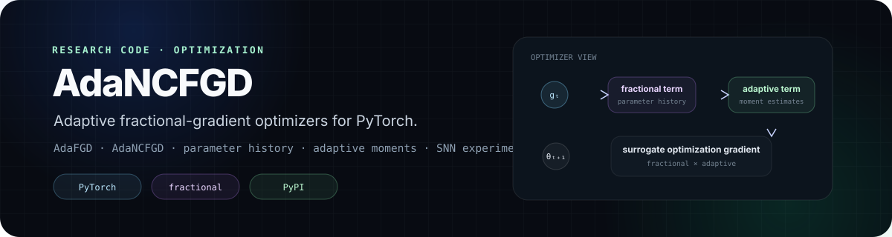
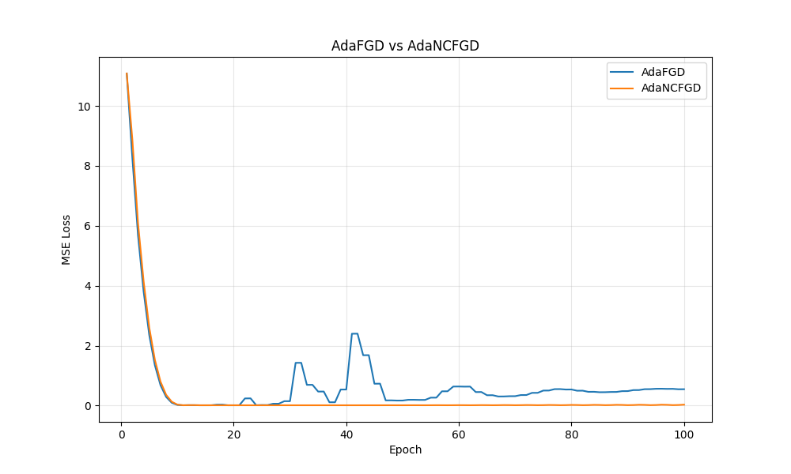
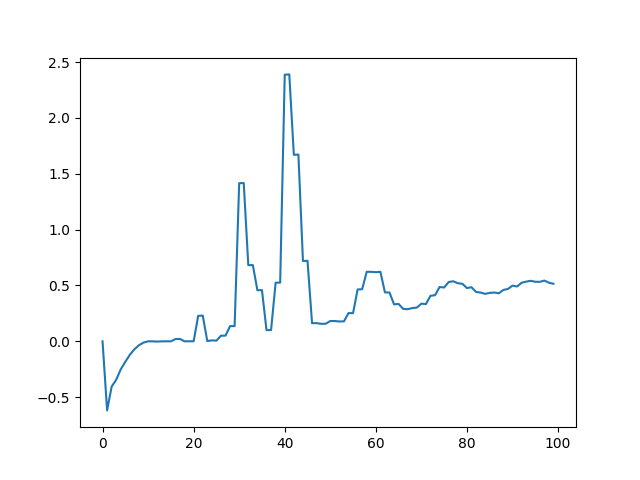

 

= 3.6"/>
= 1.7"/>

  

**Research code and PyTorch package for adaptive fractional-gradient optimization.**

---

## Overview

**AdaNCFGD** is a research-oriented optimization project centered on two PyTorch optimizers:

- **AdaFGD — Adaptive Fractional Gradient Descent**
- **AdaNCFGD — Adaptive Non-Causal Fractional Gradient Descent**

Both methods transform the ordinary gradient into a **surrogate optimization gradient** using two ingredients:

1. a fractional-gradient term derived from parameter history; and
2. an adaptive term built from running first- and second-moment statistics.

The repository also contains a Spiking Neural Network (SNN) implementation used as a research testbed, together with an MNIST training pipeline.

The optimizer package is available on PyPI as **`adancfgd`**.

---

## Research idea

Ordinary gradient-based optimization uses the current gradient:

~~~text
current parameters θₜ
        │
        ▼
   gradient gₜ
        │
        ▼
parameter update
~~~

AdaFGD and AdaNCFGD additionally retain information about previous parameter states.

Conceptually:

~~~text
current gradient gₜ
        │
        ├──────────────► adaptive moment statistics
        │
        ▼
parameter history
        │
        ▼
fractional-gradient term
        │
        └──────────────┐
                       ▼
             surrogate gradient
                       │
                       ▼
                  SGD update
~~~

The optimizer classes inherit from PyTorch's `SGD`. They replace the parameter gradient with the constructed surrogate gradient, then delegate the final parameter update to the parent SGD implementation.

---

## AdaFGD

AdaFGD keeps the previous parameter state and previous gradient.

For a parameter displacement

~~~text
Δθₜ = θₜ - θₜ₋₁
~~~

the implementation constructs a fractional term containing

~~~text
1 / Γ(2 - α)
~~~

and a displacement factor proportional to

~~~text
(|Δθₜ| + ε)^(1 - α)
~~~

where:

- `α` is the fractional order, constrained to `0 < α < 2`;
- `ε` is a small numerical-stability constant.

The implementation then multiplies this fractional term by an adaptive factor derived from bias-corrected moment estimates.

Relevant implementation:

**[`adancfgd/adancfgd.py`](./adancfgd/adancfgd.py)**

---

## AdaNCFGD

AdaNCFGD extends the same construction by retaining **two previous parameter states**.

It uses:

~~~text
θₜ
θₜ₋₁
θₜ₋₂
~~~

and checks the direction of parameter displacement across those states.

Depending on whether the optimization trajectory keeps or changes direction, the implementation selects between:

- a single-history fractional contribution; or
- a combination of contributions involving the two previous states.

This gives AdaNCFGD a richer history-dependent update rule than AdaFGD while preserving the same adaptive-moment layer and PyTorch optimizer interface.

---

## Adaptive term

Both optimizers maintain running statistics using `betas=(β₁, β₂)`.

The implementation tracks:

- a first statistic based on the sign of the gradient;
- a second statistic based on the squared gradient;
- optional AMSGrad-style maximum second moments.

After bias correction, an adaptive multiplier is formed and combined with the fractional term.

This project therefore separates the update into two conceptual components:

<table>
<tr>
<td width="50%" valign="top">

### Fractional component
Uses parameter history and the fractional order `α` to modify the optimization direction / magnitude.

</td>
<td width="50%" valign="top">

### Adaptive component
Uses running gradient statistics to rescale the fractional contribution.

</td>
</tr>
</table>

---

## Installation

### PyPI

~~~bash
pip install adancfgd
~~~

### From source

~~~bash
git clone https://github.com/HunLuanZhiZhu/AdaNCFGD.git
cd AdaNCFGD
pip install -e .
~~~

Package metadata currently declares:

~~~text
Python >= 3.6
PyTorch >= 1.7.0
NumPy
~~~

---

## Quick start

### AdaFGD

~~~python
import torch
import torch.nn as nn
from adancfgd import AdaFGD

model = nn.Linear(10, 1)

optimizer = AdaFGD(
    model.parameters(),
    lr=1e-3,
    alpha=1.0,
)

x = torch.randn(32, 10)
y = torch.randn(32, 1)
criterion = nn.MSELoss()

optimizer.zero_grad()
loss = criterion(model(x), y)
loss.backward()
optimizer.step()
~~~

### AdaNCFGD

~~~python
from adancfgd import AdaNCFGD

optimizer = AdaNCFGD(
    model.parameters(),
    lr=1e-3,
    alpha=1.2,
    betas=(0.9, 0.999),
)
~~~

The classes follow the standard PyTorch optimizer pattern, so they can be inserted into existing training loops without changing model code.

---

## Main optimizer parameters

| Parameter | Default | Meaning |
|---|---:|---|
| `lr` | `0.001` | Base learning rate passed to SGD |
| `alpha` | `1.0` | Fractional order; must satisfy `0 < α < 2` |
| `epsilon` | `1e-4` | Stability term used in the fractional displacement factor |
| `betas` | `(0.9, 0.999)` | Running-statistic coefficients |
| `eps` | `1e-8` | Stability term in the adaptive factor |
| `amsgrad` | `False` | Enable the AMSGrad-style second-moment maximum |
| `momentum` | `0.0` | SGD momentum |
| `weight_decay` | `0.0` | SGD weight decay |
| `nesterov` | `False` | Enable Nesterov momentum |

The optimizer also exposes compatible `maximize`, `foreach`, `differentiable`, and `fused` arguments where supported by the installed PyTorch version.

---

## SNN research framework

The package exports an accompanying SNN implementation used for experimentation.

Available components include:

| Component | Role |
|---|---|
| `SNNLinear` | Spiking fully connected layer |
| `SNNConv2d` | Spiking convolution layer |
| `SNNBatchNorm1d` / `SNNBatchNorm2d` | Batch normalization |
| `SNNLinearWithBatchNorm` | Composite linear SNN layer |
| `SNNConv2dWithBatchNorm` | Composite convolutional SNN layer |
| `SNNDropout` | Dropout for spike representations |
| `SNN` | Multi-layer fully connected SNN |
| `SNNCNN` | Convolutional SNN model |

Example:

~~~python
from adancfgd import SNNLinear, SNNDropout

layer = SNNLinear(784, 256)
dropout = SNNDropout(p=0.5)
~~~

The SNN code is part of the research environment around the optimizers; the core optimizer implementation remains usable with ordinary PyTorch models.

---

## MNIST experiment pipeline

The repository includes **[`train_mnist.py`](./train_mnist.py)** for SNN experiments on MNIST.

The script contains:

- Bernoulli spike encoding;
- SNN training and evaluation;
- checkpoint/history handling;
- learning-rate scheduling;
- CPU/CUDA device selection.

The dataset is expected locally under the configured data directory; the current script does not automatically download MNIST.

---

## Convergence sanity check

The repository contains two existing diagnostic figures:

These plots come from the simple linear-regression sanity check implemented in `adancfgd/adancfgd.py`.

They are intended to verify optimizer behavior on a controlled toy problem. They should **not** be interpreted as a general benchmark establishing superiority over standard optimizers.

Run the check with:

~~~bash
python -m adancfgd.adancfgd
~~~

---

## Repository structure

~~~text
AdaNCFGD/
├── adancfgd/
│   ├── __init__.py
│   ├── adancfgd.py        # AdaFGD + AdaNCFGD
│   ├── snn.py             # SNN layers / models
│   └── snn_cnn.py         # convolutional SNN
│
├── train_mnist.py         # SNN experiment pipeline
├── data/                  # local experiment data
│
├── adafgd_vs_adancfgd_convergence.png
├── adafgd_vs_adancfgd_diff.png
│
├── setup.cfg
├── pyproject.toml
├── setup.py
├── LICENSE
└── README.md
~~~

---

## Package API

The top-level package currently exports:

~~~python
from adancfgd import (
    AdaFGD,
    AdaNCFGD,
    ForwardFirstBackwardSecond,
    SNNDropout,
    SNNBatchNorm1d,
    SNNBatchNorm2d,
    SNNLinear,
    SNNLinearWithBatchNorm,
    SNNConv2d,
    SNNConv2dWithBatchNorm,
    SNN,
    SNNCNN,
    pool_spikes,
)
~~~

Current package version:

~~~text
0.1.5
~~~

---

## Research use

This repository should be treated as a **research codebase**.

The optimizer implementation is packaged for convenient reuse, while the SNN code and training scripts preserve the surrounding experimental environment.

When evaluating the methods, use controlled experiments with matched:

- model initialization;
- learning-rate search;
- training budget;
- data split;
- random seeds;
- optimizer-specific hyperparameters.

The simple diagnostic plots included in this repository are not a substitute for task-level ablation or benchmark results.

---

## Citation

If you use the software in research, you can currently cite the repository:

~~~bibtex
@software{zhu_adancfgd,
  author       = {Yihe Zhu},
  title        = {AdaNCFGD: Adaptive Fractional Gradient Descent Optimizers},
  url          = {https://github.com/HunLuanZhiZhu/AdaNCFGD},
  version      = {0.1.5},
  note         = {Research software}
}
~~~

A publication-specific citation can be added here when appropriate.

---

## License

MIT — see [LICENSE](./LICENSE).

